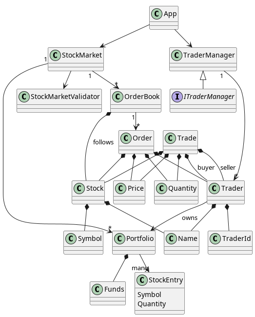
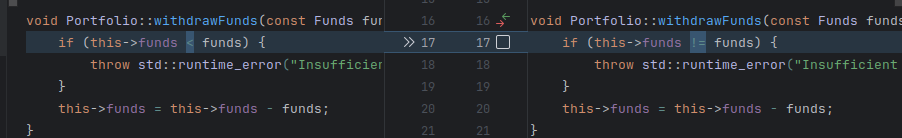
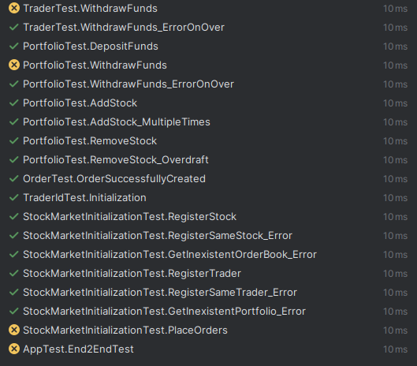
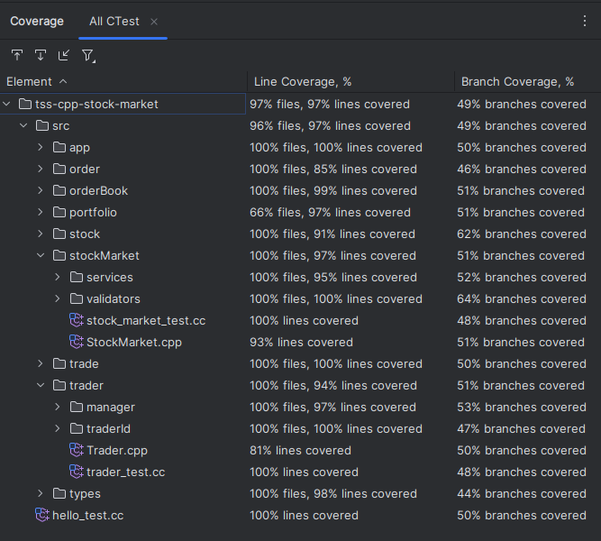

# C++ Stock Market
> Proiect Testarea Sistemelor Software


## Demo
<video width="320" height="240" controls>
  <source src="docs/demo-tss.webm" type="video/webm">
</video>

## Echipă
**Cod Echipă**: A18

**Temă**: T13 (Stock Market in C++)

**Componență echipă**: 
- Codarcea Alexandru-Christian
- Dumitrescul Eduard-Valentin
- Gavrilă Florin-Alexandru

## Setup software
- [C++ 20](https://en.cppreference.com/w/cpp/20)
- [CMake >= 3.30](https://cmake.org/)
- IDE: [CLion](https://www.jetbrains.com/clion/)
- testing framework: [googletest 1.14.0](http://google.github.io/googletest/)
- OS: Windows 11, Ubuntu 24.04, EndeavoursOS 6.13

## Introducere
**Descrierea proiectului**: 
Proiectul este despre dezvoltarea unei aplicații simple de trading. Funcționalitățile principale sunt cumpărarea si vânzarea de acțiuni, diferitele posibilități de cumpărare (explicate mai jos) market order, limit order, stop order, și urmărirea portofoliului tău. Ne bazăm pe construirea unei aplicații simple prin care să poată fi mai ușor invățate diferitele abordări tactice din lumea investițiilor.

## Terminologie:
- **stock** = o acțiune reprezintă o unitate de proprietate într-o companie, de obicei sub formă de acțiuni. Acesta oferă acționarului un drept asupra unei părți din activele și profiturile companiei.
- [stock market](https://en.wikipedia.org/wiki/Stock_market) = bursa de valori este o platformă sau o rețea unde acțiunile (și alte instrumente financiare, cum ar fi obligațiunile, mărfurile etc.) sunt cumpărate și vândute.
- **trader** = un trader este o persoană sau o entitate care cumpără și vinde instrumente financiare (precum acțiuni, obligațiuni, mărfuri etc.) pe piața de capital.
- **order** = un ordin reprezintă o instrucțiune dată de un investitor sau trader de a cumpăra sau vinde o anumită cantitate de instrument financiar (de exemplu, acțiuni) la un preț anume sau sub anumite condiții. Exemple de ordine sunt ordinele de piață, ordinele limită și ordinele stop.
- **order book** = cartea de ordine este o listă în timp real, organizată, a ordinelor de cumpărare și vânzare pentru o anumită acțiune sau alt activ pe piață. Ea arată cantitatea și prețul ordinelor plasate de traderi care nu au fost încă executate, oferind o imagine asupra dinamicii cererii și ofertei pe piață.

## Platforme existente
- **https://www.xtb.com/ro**
- **https://www.interactivebrokers.com/**
- **https://robinhood.com/eu/en/about/crypto/**

Avantajele platformelor existente sunt că pot fi folosite în mod oficial pentru cumpărare și vânzare, dar sunt încărcate de funcționalități. Astfel, noi venim cu o aplicație simplă, care păstrează functionalitățile de bază și care poate fi folosită pentru învățare.

## Business Logic

### Plasarea unui ordin de cumpărare sau vânzare

Un **ordin** poate fi de mai multe tipuri:

- **Ordin de piață (Market Order)**: Când un trader plasează un ordin de piață, acesta cumpără sau vinde acțiuni la prețul actual de pe piață. Ordinul va fi executat imediat, respectând prețul de pe piața de valori.
  
- **Ordin limită (Limit Order)**: Un ordin limită este un ordin de a cumpăra sau vinde acțiuni doar la un preț specificat. Dacă prețul acțiunii ajunge la valoarea dorită, ordinul va fi executat. Dacă prețul nu ajunge la acea valoare, ordinul va rămâne în **cartea de ordine** și va aștepta să fie îndeplinit.

- **Ordin stop (Stop Order)**: Un ordin stop este activat când prețul acțiunii atinge un anumit prag. Acesta este de obicei folosit pentru a limita pierderile sau pentru a asigura profituri într-o tranzacție.

### Interacțiunea cu Cartea de Ordine

- **Plasarea unui ordin într-o carte de ordine**: Când un trader plasează un ordin, acesta este adăugat într-o **carte de ordine** pentru o anumită acțiune sau activ financiar. De exemplu, un trader poate plasa un ordin de cumpărare limită de 100 de acțiuni ale unei companii la prețul de 50 lei pe acțiune. Această comandă va fi vizibilă pentru alți traderi în **cartea de ordine**.
  
- **Executarea ordinelor**: Dacă există un alt trader care plasează un ordin de vânzare care coincide cu ordinul de cumpărare al unui alt trader (de exemplu, vinde 100 de acțiuni la 50 lei pe acțiune), atunci ordinul va fi executat automat.

### Actualizarea continuă a cărții de ordine

Cartea de ordine se actualizează în timp real. Când un **ordin** este executat, acesta dispare din listă. Dacă prețul unui activ se modifică, **cartea de ordine** va reflecta aceste schimbări. Traderii vor putea vizualiza mereu ofertele disponibile de cumpărare și vânzare.

## Studii de caz și analize aprofundate

Există numeroase studii de caz care evidențiază, prin analize aprofundate, importanța testării software în asigurarea calității aplicațiilor.

### Exemplu I : Testare Software și Calitate în Sisteme de Supraveghere a Pieței - Exactpro

### Introducere
Exactpro este o companie specializată în servicii de asigurare a calității software și dezvoltare de soluții de testare automată, cu un accent deosebit pe infrastructurile financiare globale.

### Ce este un Market Surveillance System?

Un sistem de supraveghere a pieței (Market Surveillance System) este o platformă complexă folosită în domeniul financiar pentru a monitoriza tranzacțiile și comportamentele de pe piețele bursiere și de tranzacționare. Scopul principal este de a detecta comportamente abuzive, manipulări ale pieței sau activități ilegale (precum spoofing, layering, wash trading), asigurând astfel respectarea reglementărilor și integritatea pieței. Aceste sisteme procesează volume mari de date în timp real și offline, analizează fluxuri de tranzacții, semnale de piață și știri, generează alerte automate și oferă instrumente pentru investigarea comportamentelor suspecte.

### Context
Exactpro a testat sisteme de supraveghere a pieței conectate la platforme de tranzacționare și furnizori de date de piață, caracterizate prin procese complexe de data mining, mecanisme de alertare și arhitecturi distribuite.

### Rolul Testării în Creșterea Calității
Pentru a asigura calitatea și conformitatea sistemelor de supraveghere a pieței, Exactpro a aplicat:
- Construirea și întreținerea bibliotecilor de testare și regresie acoperind întregul sistem.
- Automatizarea proceselor de testare utilizând instrumente specializate precum Sailfish și Shsha.
- Testare end-to-end a fluxurilor de date, inclusiv injectare, capturare și comparație a rezultatelor.
- Validarea modelelor de alertare pentru comportamente abuzive (ex: spoofing, layering) prin teste automate.
- Verificarea consistenței datelor între sistemele externe și sistemele de supraveghere.
- Adaptarea testării pentru sisteme moderne bazate pe cloud și integrarea AI/ML pentru detectarea automată a fraudelor.

### Concluzie
Prin optimizarea testării software:
- S-a redus numărul de erori și alerte false în sistemele de supraveghere.
- A crescut eficiența echipelor de conformitate, economisind timp și resurse.
- S-a asigurat respectarea cerințelor de reglementare financiară, îmbunătățind reziliența și fiabilitatea infrastructurii de tranzacționare.

### Mai multe detalii
Pentru o analiză completă a studiului de caz : [A Case Study in Market Surveillance - Exactpro (PDF)](https://exactpro.com/sites/default/files/attachments/A%20Case%20Study%20in%20Market%20Surveillance_1.pdf)

### Exemplu II : Îmbunătățirea Calității Software prin Testare - Barclays

### Context
Barclays, una dintre principalele bănci din UK, întâmpina frecvente crash-uri și probleme de performanță în aplicația sa de mobile banking, afectând negativ experiența utilizatorilor și imaginea brandului.

### Rolul Testării în Creșterea Calității
Pentru a îmbunătăți stabilitatea și performanța aplicației, Barclays a:
- Realizat o evaluare completă a proceselor de testare existente.
- Implementat testare automată pentru funcționalități critice.
- Efectuat teste de performanță și încărcare pentru a identifica blocajele.
- Adoptat testarea continuă (CI/CT) pentru validarea constantă a noilor versiuni.

### Concluzie
Îmbunătățirile aduse testării software au avut un impact direct asupra calității aplicației:
- Crash-urile au scăzut cu 60%.
- Satisfacția utilizatorilor a crescut cu 30%.
- Numărul reclamațiilor legate de aplicație a fost semnificativ redus, consolidând reputația Barclays.

### Mai multe detalii
Pentru o analiză completă a studiului de caz : [Software Testing Case Studies - The Knowledge Academy](https://www.theknowledgeacademy.com/blog/software-testing-case-studies/)

## Evaluări Comparative

Aceste grafice ilustrează comparația dintre situația inițială și rezultatele obținute după implementarea riguroasă a proceselor de testare în aplicații. Aceste evaluări evidențiază impactul direct al testării asupra stabilității, performanței și satisfacției utilizatorilor.


Pentru informații suplimentare și documentație extinsă : [Resurse de învățare](#resurse-de-invățare).

### Concluzie
Având în vedere studiile de caz analizate, evaluările comparative și bunele practici identificate, aplicația noastră de stock market va integra o strategie completă de testare, care va include: testare continuă prin procese de CI/CD (Continuous Integration/Continuous Deployment), unit tests pentru verificarea modulelor individuale, integration tests pentru validarea interacțiunii dintre componente, end-to-end (E2E) tests pentru simularea fluxurilor reale de utilizare, black-box testing pentru testarea funcționalității externe fără cunoașterea codului sursă și white-box testing pentru verificarea logicii interne și structurii codului.

## Resurse de învățare
- https://testsigma.com/blog/test-cases-for-trading-application/
- https://codoid.com/automation-testing/comprehensive-strategies-to-test-trading-software/
- https://www.cigniti.com/blog/testing-trading-systems-the-right-way/
- https://exactpro.com/sites/default/files/attachments/A%20Case%20Study%20in%20Market%20Surveillance_1.pdf
- https://www.theknowledgeacademy.com/blog/software-testing-case-studies/
- https://duplextech.com/blogs/case-studies-successful-software-testing-projects.html
- https://core.ac.uk/download/pdf/16333079.pdf

---
# Arhitectura finala


### Principiile Programării Orientate pe Obiect aplicate

Pentru a facilita **dezvoltarea** și **mentenanța** aplicației, am respectat 
principiile fundamentale ale programării orientate pe obiect:

- **Encapsularea**

Fiecare clasă are responsabilități bine definite și își ascunde detaliile 
interne față de celelalte componente. Aceasta reduce dependențele și crește claritatea codului.

**Exemplu:**
Clasa `Trader` gestionează propriul `TraderId`, `Name` și `Portfolio`. Accesul la 
aceste date se face prin metode dedicate, fără a expune direct atributele interne.

- **Abstractizarea**

Am separat **ce face** o clasă de **cum face**. Clasele oferă o interfață publică 
clară, ascunzând complexitatea implementării.

**Exemplu:**
Interfața `ITraderManager` definește funcționalitățile managerului de traderi, fără 
a depinde de o implementare concretă. Acest lucru permite extinderea sau modificarea
comportamentului fără a afecta codul dependent.

- **Moștenirea**

Am utilizat moștenirea pentru a extinde funcționalitatea unor clase și a promova 
reutilizarea codului.

**Exemplu:**
Clasa `TraderManager` implementează interfața `ITraderManager`, moștenind contractul
funcțional pe care trebuie să-l respecte.

- **Polimorfismul**

Aplicația poate trata obiecte de tipuri diferite într-un mod unitar, prin intermediul 
interfețelor sau claselor de bază.

**Exemplu:**
Prin utilizarea interfeței `ITraderManager`, componentele aplicației pot interacționa 
cu orice implementare a acesteia, fără să cunoască detalii concrete despre instanțele 
folosite.

---


# Testarea Implementarii
Pentru a asigura functionarea conforma a platformei, am utilizat o 
abordare in 3 pasi:
- scrierea unor teste ce acopera cat mai bine functionalitatea pe care 
o dorim
- implementearea noii functionalitati
- executarea testelor si ajustarea implementarii in cazul in care
exista teste esuate (acest pas se repeta pana cand toate testele trec)

## Strategii de Testare
### Testare unitara
Am utilizat teste unitare pentru a verifica constrangerile pe care le-am impus
(business logic). Spre exemplu, Un utilizator nu poate avea mai mult de un miliard 
fonduri.

`src/types/funds/funds_test.cc`
```cpp
TEST(FundsTest, FundsAreAtMostABillion) {
        EXPECT_NO_THROW({
        Funds funds(1e9);
    });

    EXPECT_THROW({
        Funds funds(1e9+1);
    },
    std::invalid_argument);

    EXPECT_THROW({
        Funds funds(1e10);
    },
    std::invalid_argument
    );
}
```
In acest caz, am utilizat analiza valorilor de frontiera pentru a determina 
valorile testate:
- 1,000,000,000 (respecta constrangerile)
- 1,000,000,001 (nu respecta constragerile, arcunca o exceptie)

De asemenea, am scris teste unitare si pentru a testa functionalitati diverse. 
Spre exemplu, adugarea de fonduri unui actionar (trader):
`src/trader/trader_test.cc`
```cpp
TEST_F(TraderTest, DepositFunds) {
    Funds initialFunds = trader.getFunds();
    Funds expectedInitialFunds = Funds(0);
    EXPECT_EQ(initialFunds, expectedInitialFunds);


    trader.depositFunds(funds100);
    Funds currentFunds = trader.getFunds();
    Funds expectedCurrentFunds = funds100;
    EXPECT_EQ(currentFunds, expectedCurrentFunds);
}
```

### Testrarea Integrarii
Am utilizat **teste whitebox** pentru a verifica functionalitati mai complexe
(in care multiple clase interactioneaza). Un exemplu este testul pentru plasarea
ordinelor in clasa StockMarket in cadrul caruia am verificat ca 
tranzactiile de actiuni sunt efectuate corespunator si portofoliile si fondurile
actionarilor actualizate.


`src/stcokMarket/stock_market_test.cc`
```cpp
TEST_F(StockMarketInitializationTest, PlaceOrders) {
    market->registerStock(stock);
    market->registerTrader(trader);
    market->registerTrader(trader2);
    portfolio2->addStock(stock, sellQuantity);

    auto initialFundsBuyer = portfolio->getFunds();
    auto initialFundsSeller = portfolio->getFunds();

    Order order(trader, stock, buyQuantity, buyPrice);
    Order order2(trader2, stock, sellQuantity, sellPrice);

    auto trades = market->placeBuyOrder(order);
    EXPECT_TRUE(trades.empty());

    // verify trade details
    auto trades2 = market->placeSellOrder(order2);
    auto tradeQuantity = std::min(sellQuantity, buyQuantity);
    EXPECT_EQ(trades2.size(), 1);
    EXPECT_EQ(trades2[0].getQuantity(), tradeQuantity);
    EXPECT_EQ(trades2[0].getPrice(), sellPrice);

    auto tradeFunds = trades2[0].getTotalFunds();
    // verify portfolio changes
    EXPECT_EQ(portfolio->getFunds(), initialFundsBuyer - tradeFunds);
    EXPECT_EQ(portfolio2->getFunds(), initialFundsSeller + tradeFunds);

    // verify buyer now has stock holdings
    EXPECT_EQ(portfolio->getStockQuantity(stock), buyQuantity);
    EXPECT_EQ(portfolio2->getStockQuantity(stock), sellQuantity - buyQuantity);
}
```

### Testare End-to-End
In fisierul 'src/app/app_test.cc' am inclus un test care verifica un intreg flux ce contine
functionalitatile principale pe care le foloseste un utilizator al platformei:
- adaugare fonduri
- adaugare ordin de tip sell
- adaugare ordin de tip buy


### Generarea mutantilor
Cu ajutorul script-ului `mutants/main_mutants.cpp`, putem genera mutanti ai programului.
Un exemplu de rulare, in care a fost modificata conditia unui _if_:

Cand rulam toate testele observam ca avem 4 care esueaza:


## Analiza
Cu ajutorul tool-ului de Coverage inclus in CLion, am obtinut:
- 97% code overage
- 97% line coverage
- 49% branch coverage


# Raport AI
Pe parcursul acestui proiect, am folosit urmatoarele unelte de Inteligenta Artificiala:
- ChatGPT:
  - verificarea exprimarii in documentatie si adaugarea diacriticelor
  - verificarea diagramei arhitecturii
